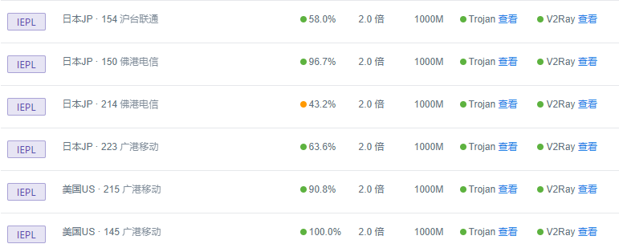
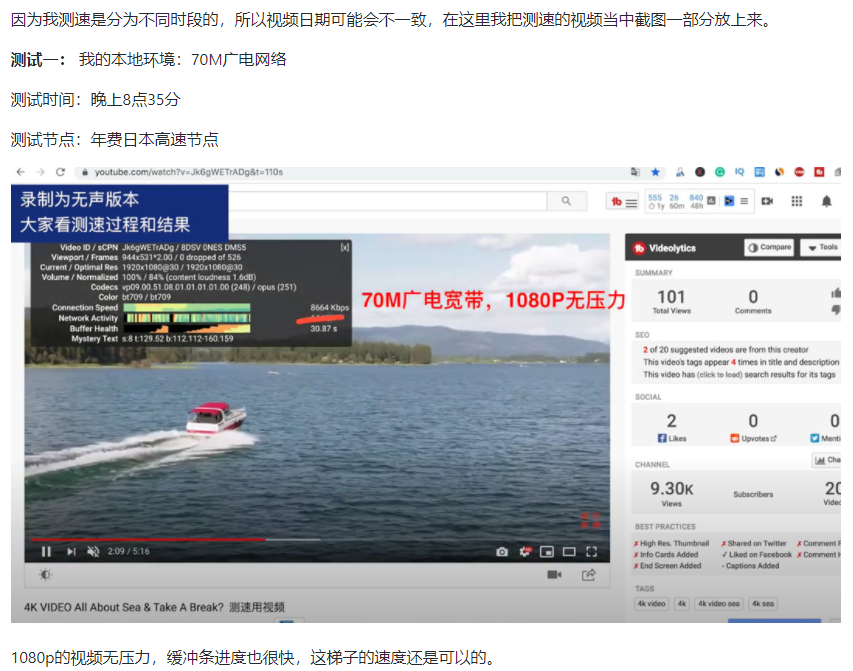
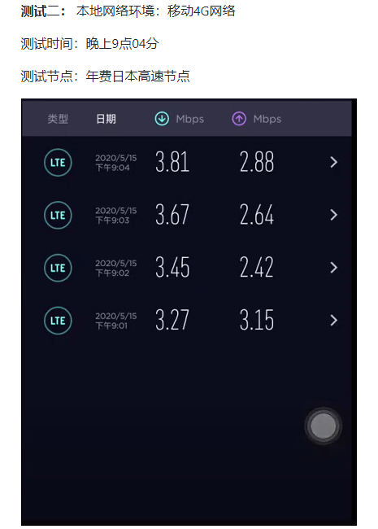

# 世界前三永久免费电脑梯子测评，稳定安全好用
永久免费梯子,免费电脑梯子软件,世界Top3梯子,高性价比梯子软件,便宜的梯子软件,知乎推荐梯子,科学上网最新工具软件,还能用的梯子软件,手机梯子软件推荐,免费的手机梯子

## 大家好，这里是老白测评，最近好多小伙伴私信要老王推荐个[免费的电脑梯子](https://www.dazhuanlan.com/yuluoqingtian/topics/2635282)，而且还得稳定好用，最好是没有弹窗和广告的那种，推荐稳定好用的梯子这块儿，老白还是有点发言权的，今天就全方位给大家测评下这款免费而且好用的梯子软件：西部世界（Westworld VPN）

西部世界这款梯子是老王自己用了比较久的电脑梯子，他的官网支持中英双语切换，所以不管你使用什么语言，都能够流畅访问他们的官网。

### 官网地址：[https://xbsj4621.fun/i/th050](https://xbsj4621.fun/i/th050)

官网截图：

我最早接触这款免费电脑梯子软件，还是之前为了在mac系统中找到一个好用的V2ray梯子，那会儿刚从windows系统的使用过渡到mac系统，首先就是需要一个好用的梯子工具软件，早期使用的时候，它的mac客户端确实很简洁，网络和网速各方面综合性能表现也很不错，因此我用了比较久的一段时间。

后来开始做测评，接触的**翻墙梯子工具**多了，也买了数不清的梯子年费会员，想着钱不能白花，所以陆陆续续一直在更换各种梯子使用。

这次再回头测评这款梯子，也是因为有不少粉丝和我提起过，并且要求我出一期针对西部世界的全方位测评，所以这次会针对不同的角度，给大家全方位剖析下这款梯子软件。

注：本次测评我没有收取任何的广告费。

## 一、Westworld梯子软件的概况

在网上查阅了各类消息发现，西部世界总部位于北美，并且最早可追溯到四年前，运营时间已经算是比较久了，和**Express以及Nord等梯子**相比，它没有透露在全世界多少国家拥有多少台服务器这类消息，所以暂时无从考究。

目前这个电脑梯子软件推出了mac,ios,windows,安卓,Linux等多系统的独立客户端，对于用户而言，下载他们的客户端使用还是很方便的。

## 二、西部世界是不是一款稳定好用的梯子？

这个问题见仁见智，在最早期的时候，他们是首家推出Trojan协议的梯子软件平台，这还是一年多近两年前的事情，不过那会儿他们的**mac系统Trojan客户端**偶尔会出现间歇性断流的情况，这段时间下载使用之后，我发现这种断流情况已经彻底消失了，整个线路质量包括客户端的易用性和稳定性提升了一大截。

他们的客户端很清爽，没有任何的弹窗或者广告，包括安装也很方便，不需要下载运行库之类的插件。

在网速方面也进行了测试，Youtube 4K视频毫无压力，解锁Netflix也是没有问题，在观影过程中零卡顿，可见这两年它的后台进行过几波比较大的升级，整个性能和稳定性向上跃迁了一个很大的层次。

## 三、西部世界免费电脑梯子的优势

1、支持Netflix，Fulu等流媒体，虽然之前也有不少的[电脑梯子软件](https://github.com/yourkind/bestvpn)支持解锁流媒体，但更多的是解锁了观看，在观影过程当中的速度不尽人意，很影响体验，西部世界这款梯子软件的流媒体节点我试了一下，观影过程中0卡顿，整个过程非常流畅，并且能够解锁的流媒体平台也很丰富，不仅仅是奈飞和Fulu。

2、活动以及福利

西部世界后台经常会有一些活动，比如邀请好用赠送使用时长，或者做任务能够增加使用时长等等，不过这些不是重点，除非身边有朋友主动来讨要，不然也不会随便去给别人推荐梯子软件。

四、免费好用的节点概况。

目前西部世界后台节点全部都是IEPL专线，并且地区类型也很丰富，首页也有订阅链接，通过订阅链接可以一键导入他们后台所有的节点，支持各类第三方插件使用：

点击查看选项也会出现二维码，用软件扫描就可以连上该节点，IEPL节点线路我挑了几条试了一下，基本都能把本地网速拉满，如果是本地网络是100M宽带，那么秒开4K之类的也是没有任何压力的。

五、最重要的速度测试。

### 上面所有，就是这期我对西部世界这款免费电脑梯子软件的所有测评，综合情况而言，这是一款稳定而且好用的翻墙梯子工具，如果你想找一个用起来顺手，兼具性价比的软件，西部世界应该是最优解，目前西部世界后台也配备了外服游戏专用的节点，不过我个人没有外服账号，所以没测试，但从其他节点质量来看，相信不会差，大家可以根据我以上的测评，来选择是否去使用这款梯子软件。
